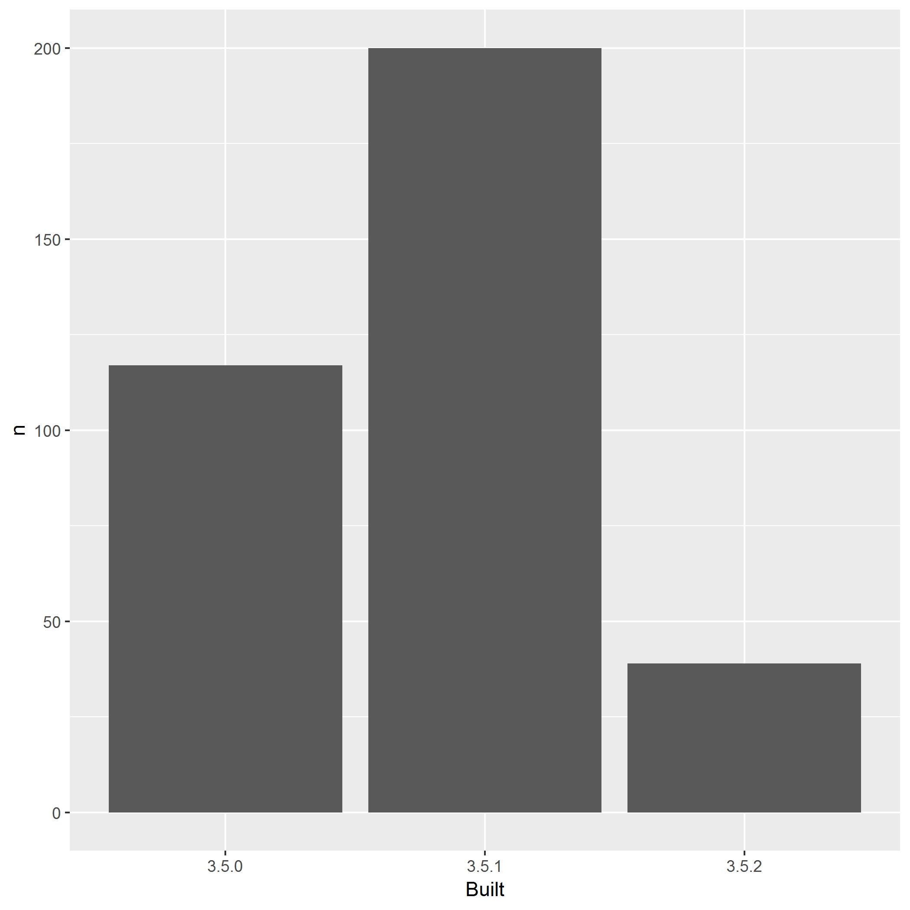

<!-- README.md is generated from README.Rmd. Please edit that file -->

# packages-report

## Bonus activity prompt

  - Combine your work analyzing your R packages and what we’ve learned
    re: GitHub and R Markdown
  - This `README.Rmd` gives a scaffold for using the work you did
    earlier to make a little report.
  - Given our previous work, I’m using pre-computed results and
    including a pre-made figure, leaving the R code down in scripts
    below `R/`. But know that, in other contexts, you could inline all
    that code in chunks here. Depends on downstream usage and the
    project context.
  - Locally, do `README.Rmd` –\> `README.md` with the “Knit” button or
    via `rmarkdown::render("README.Rmd")`. Commit both.
  - I presume you are hooked up to GitHub remote repo, covered in
    [Existing project, GitHub
    last](https://happygitwithr.com/existing-github-last.html). Summary:
      - Consider the convenience function `usethis::use_github()`. Or to
        do by hand:
      - Create a similarly-named repo on GitHub.
      - Add it to the local repo as the `origin` remote: `git remote add
        origin https://github.com/YOU/REPO.git`.
      - Push and cement the branch tracking relationship: `git push
        --set-upstream origin master`.
  - Push\! Now your README is an excellent welcome mat and summary of
    your project.
  - On GitHub, in *Settings*, turn on GitHub Pages. Visit the given URL
    for an even more polished report of your project. It may take a few
    minutes to show up / update. Record that as the URL for your repo.

## Overview

The goal of packages-report is to FINISH THIS SENTENCE.

I have `FILL THIS IN!!!` add-on packages installed.

Here’s how they break down in terms of which version of R they were
built under, which is related to how recently they were updated on CRAN.



### Flow of the analysis

*If you have time, document the analysis works, using internal links.*

*If you created some sort of controller script, describe that here.*

<details>

<summary>Session info</summary>

``` r
devtools::session_info()
#> - Session info ----------------------------------------------------------
#>  setting  value                       
#>  version  R version 3.5.2 (2018-12-20)
#>  os       Windows 10 x64              
#>  system   x86_64, mingw32             
#>  ui       RTerm                       
#>  language (EN)                        
#>  collate  English_United States.1252  
#>  ctype    English_United States.1252  
#>  tz       America/New_York            
#>  date     2019-01-15                  
#> 
#> - Packages --------------------------------------------------------------
#>  package     * version    date       lib source                           
#>  assertthat    0.2.0      2017-04-11 [1] CRAN (R 3.5.0)                   
#>  backports     1.1.3      2018-12-14 [1] CRAN (R 3.5.1)                   
#>  bindr         0.1.1      2018-03-13 [1] CRAN (R 3.5.0)                   
#>  bindrcpp      0.2.2      2018-03-29 [1] CRAN (R 3.5.0)                   
#>  broom         0.5.1      2018-12-05 [1] CRAN (R 3.5.1)                   
#>  callr         3.1.1      2018-12-21 [1] CRAN (R 3.5.1)                   
#>  cellranger    1.1.0      2016-07-27 [1] CRAN (R 3.5.0)                   
#>  cli           1.0.1      2018-09-25 [1] CRAN (R 3.5.1)                   
#>  colorspace    1.3-2      2016-12-14 [1] CRAN (R 3.5.0)                   
#>  crayon        1.3.4      2017-09-16 [1] CRAN (R 3.5.1)                   
#>  desc          1.2.0      2018-12-17 [1] Github (r-lib/desc@42b9578)      
#>  devtools      2.0.1      2018-10-26 [1] CRAN (R 3.5.1)                   
#>  digest        0.6.18     2018-10-10 [1] CRAN (R 3.5.1)                   
#>  dplyr       * 0.7.8      2018-11-10 [1] CRAN (R 3.5.1)                   
#>  evaluate      0.12       2018-10-09 [1] CRAN (R 3.5.1)                   
#>  forcats     * 0.3.0      2018-02-19 [1] CRAN (R 3.5.0)                   
#>  fs            1.2.6      2018-08-23 [1] CRAN (R 3.5.1)                   
#>  generics      0.0.2      2018-11-29 [1] CRAN (R 3.5.2)                   
#>  ggplot2     * 3.1.0      2018-10-25 [1] CRAN (R 3.5.1)                   
#>  glue          1.3.0      2018-07-17 [1] CRAN (R 3.5.1)                   
#>  gtable        0.2.0      2016-02-26 [1] CRAN (R 3.5.0)                   
#>  haven         2.0.0      2018-11-22 [1] CRAN (R 3.5.1)                   
#>  hms           0.4.2      2018-03-10 [1] CRAN (R 3.5.0)                   
#>  htmltools     0.3.6      2017-04-28 [1] CRAN (R 3.5.0)                   
#>  httr          1.4.0      2018-12-11 [1] CRAN (R 3.5.2)                   
#>  jsonlite      1.6        2018-12-07 [1] CRAN (R 3.5.1)                   
#>  knitr         1.21       2018-12-10 [1] CRAN (R 3.5.1)                   
#>  lattice       0.20-38    2018-11-04 [1] CRAN (R 3.5.2)                   
#>  lazyeval      0.2.1      2017-10-29 [1] CRAN (R 3.5.0)                   
#>  lubridate     1.7.4      2018-04-11 [1] CRAN (R 3.5.1)                   
#>  magrittr      1.5        2014-11-22 [1] CRAN (R 3.5.1)                   
#>  memoise       1.1.0.9000 2018-12-13 [1] Github (hadley/memoise@1650ad7)  
#>  modelr        0.1.2      2018-05-11 [1] CRAN (R 3.5.0)                   
#>  munsell       0.5.0      2018-06-12 [1] CRAN (R 3.5.0)                   
#>  nlme          3.1-137    2018-04-07 [1] CRAN (R 3.5.2)                   
#>  pillar        1.3.1      2018-12-15 [1] CRAN (R 3.5.1)                   
#>  pkgbuild      1.0.2      2018-10-16 [1] CRAN (R 3.5.1)                   
#>  pkgconfig     2.0.2      2018-08-16 [1] CRAN (R 3.5.1)                   
#>  pkgload       1.0.2      2018-10-29 [1] CRAN (R 3.5.1)                   
#>  plyr          1.8.4      2016-06-08 [1] CRAN (R 3.5.0)                   
#>  prettyunits   1.0.2      2015-07-13 [1] CRAN (R 3.5.0)                   
#>  processx      3.2.1      2018-12-05 [1] CRAN (R 3.5.1)                   
#>  ps            1.3.0      2018-12-21 [1] CRAN (R 3.5.2)                   
#>  purrr       * 0.2.5      2018-05-29 [1] CRAN (R 3.5.1)                   
#>  R6            2.3.0      2018-10-04 [1] CRAN (R 3.5.1)                   
#>  Rcpp          1.0.0      2018-11-07 [1] CRAN (R 3.5.1)                   
#>  readr       * 1.3.1      2018-12-21 [1] CRAN (R 3.5.2)                   
#>  readxl        1.2.0      2018-12-19 [1] CRAN (R 3.5.1)                   
#>  remotes       2.0.2      2018-10-30 [1] CRAN (R 3.5.2)                   
#>  rlang         0.3.1      2019-01-08 [1] CRAN (R 3.5.2)                   
#>  rmarkdown     1.11       2018-12-08 [1] CRAN (R 3.5.1)                   
#>  rprojroot     1.3-2      2018-01-03 [1] CRAN (R 3.5.0)                   
#>  rstudioapi    0.9.0      2019-01-09 [1] CRAN (R 3.5.2)                   
#>  rvest         0.3.2      2016-06-17 [1] CRAN (R 3.5.0)                   
#>  scales        1.0.0      2018-08-09 [1] CRAN (R 3.5.1)                   
#>  sessioninfo   1.1.1      2018-11-05 [1] CRAN (R 3.5.1)                   
#>  stringi       1.2.4      2018-10-21 [1] Github (gagolews/stringi@6c867b9)
#>  stringr     * 1.3.1      2018-05-10 [1] CRAN (R 3.5.1)                   
#>  testthat      2.0.1      2018-10-13 [1] CRAN (R 3.5.1)                   
#>  tibble      * 2.0.1      2019-01-12 [1] CRAN (R 3.5.2)                   
#>  tidyr       * 0.8.2      2018-10-28 [1] CRAN (R 3.5.1)                   
#>  tidyselect    0.2.5      2018-10-11 [1] CRAN (R 3.5.1)                   
#>  tidyverse   * 1.2.1      2017-11-14 [1] CRAN (R 3.5.1)                   
#>  usethis       1.4.0.9000 2019-01-09 [1] Github (r-lib/usethis@85bf30a)   
#>  withr         2.1.2      2018-03-15 [1] CRAN (R 3.5.1)                   
#>  xfun          0.4        2018-10-23 [1] CRAN (R 3.5.1)                   
#>  xml2          1.2.0      2018-01-24 [1] CRAN (R 3.5.0)                   
#>  yaml          2.2.0      2018-07-25 [1] CRAN (R 3.5.1)                   
#> 
#> [1] C:/Users/LeporeM/Documents/R/R-3.5.2/library
```

</details>

*See <https://github.com/jennybc/wtf-packages-report-EXAMPLE> for a
fully realized example.*

Hello world from GitHub

Change on past

Change here

Local.
